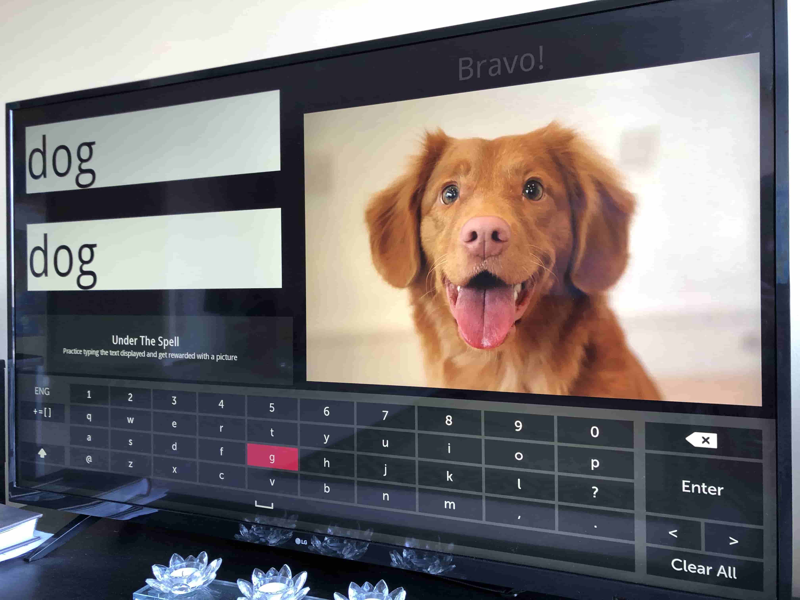
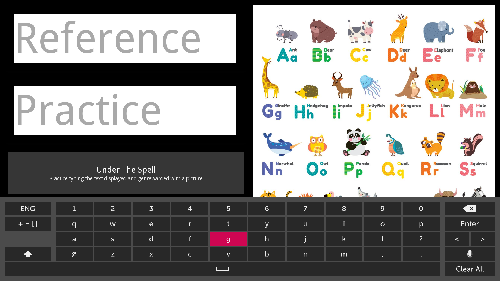
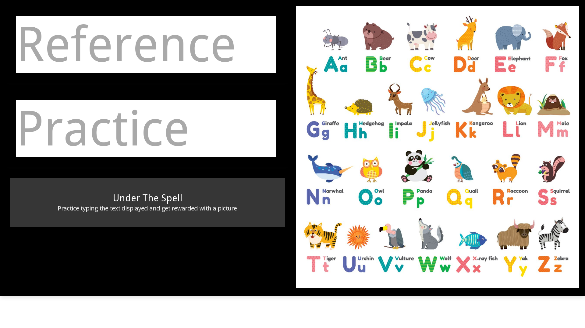
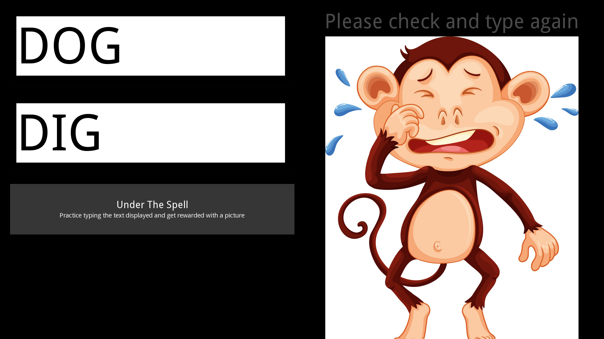
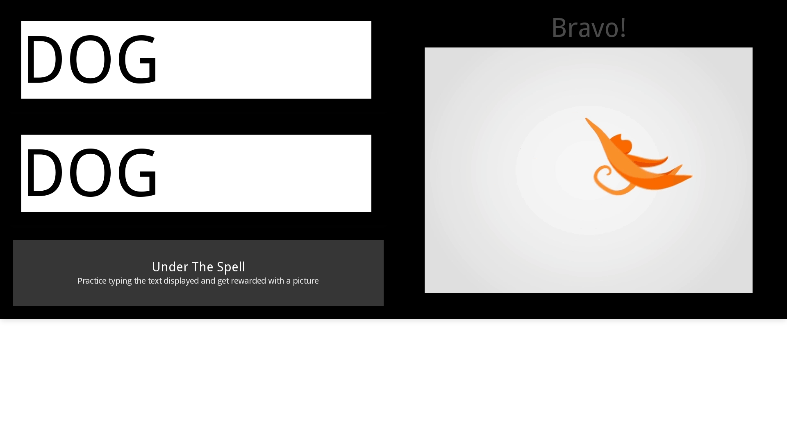
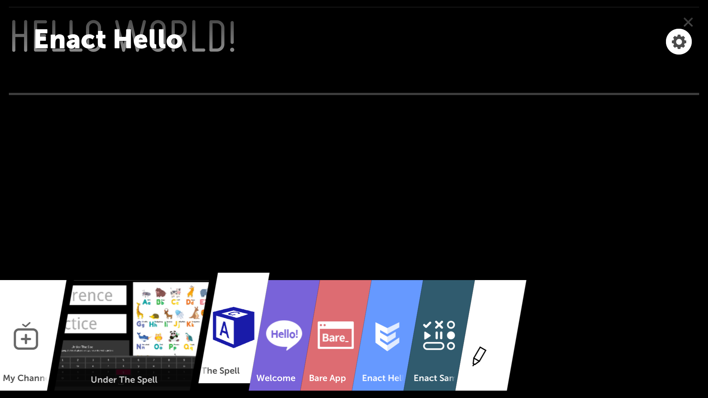

# Under the Spell

  

A simple spelling learning app for kids build using LG WebOS SDK for LG TVs.

This app has two text input fields

- Reference text input field to be used by teacher / adult

- Practice input field to be used by learner / kid



## Installation

 1. Download and update code from Github - [https://github.com/ashok2ashok/UnderTheSpell/archive/master.zip](https://github.com/ashok2ashok/UnderTheSpell/archive/master.zip)
	 -  Follow instructions described in [Google Custom Search API Key](#google-custom-search-api-key) to update Google Custom Search API Key in `script\credentials.js`
 2. Enable Developer Mode on your LG TV by following instructions here - [http://webostv.developer.lge.com/develop/app-test/](http://webostv.developer.lge.com/develop/app-test/)
	 2. After enabling, your screen should look like below: 
	 
 3. Download the LG WebOS SDK here - [http://webostv.developer.lge.com/sdk/installation/](http://webostv.developer.lge.com/sdk/installation/). If you want to just install the app on the TV and don't need any development environment, then install the CLI or minimal version for your OS.
 4. Install the CLI / Minimal version by following instructions in this page - [http://webostv.developer.lge.com/sdk/installation/](http://webostv.developer.lge.com/sdk/installation/)
	 - Unzip the downloaded installer package.
	 - Navigate to the unzipped directory and execute the installer executable file.
	 - Perform the following:
		 - **Screen 1:**  Accept the license agreement.
		 - **Screen 2:** Select the installation directory, view the components that will be installed, and click **INSTALL**.
		 If you have not changed the target directory during installation, you can find the SDK in the following locations:
			 - Linux: /usr/local/share/webOS_TV_SDK
			 - Mac OS: /opt/webOS_TV_SDK
			 - Windows: C:\webOS_TV_SDK
		 - **Screen 3:** On completing the installation, read the information on the screen, and click  **DONE**.
	 - Restart the system to ensure that the installation works properly.
 5. Execute commands similar to below to install TV as emulator, package and install the app on TV. These commands are explained here - [http://webostv.developer.lge.com/sdk/tools/using-webos-tv-cli/testing-web-app-cli/](http://webostv.developer.lge.com/sdk/tools/using-webos-tv-cli/testing-web-app-cli/).

```
ashok$ pwd
/opt/webOS_TV_SDK/CLI/bin

ashok$ ./ares-setup-device
name      deviceinfo                  connection  profile
--------  --------------------------  ----------  ------- 

** You can modify the device info in the above list, or add new device.
? Select add
? Enter Device Name: MyTV
? Enter Device IP address: <get-ip-from-tv-developer-mode>
? Enter Device Port: 9922
? Enter ssh user: prisoner
? Enter description: new device
? Select authentication password <get-from-tv-developer-mode>
? Enter password: [hidden]
? Save ? Yes
name      deviceinfo                  connection  profile
--------  --------------------------  ----------  -------
MyTV      prisoner@<ip-from-tv-developer-mode>:9922  ssh         tv    


ashok$ ./ares-novacom --device MyTV --getkey
SSH Private Key: /Users/ashok/.ssh/MyTV_webos


input passphrase [default: webos]:2674F0
ashok$ ./ares-install --device MyTV --list


ashok$ ./ares-package "<source-code-unzipped-download-location>/Under-The-Spell"
Creating package im.ashok.webos.spell_0.0.1_all.ipk in /opt/webOS_TV_SDK/CLI/bin
Success


ashok$ ./ares-install --device MyTV ./im.ashok.webos.spell_0.0.1_all.ipk
Installing package ./im.ashok.webos.spell_0.0.1_all.ipk
Success
```

## Process

Follow the below steps to get most value out of this app:

1. Type the word/spelling you want to teach in the **Reference** text field

2. Press Down button on the Remote / Tab on the keyboard to **switch focus to the Practice field**.

3. Give the Remote / Keyboard to the learner/kid and ask him/her to watch the word in the reference field and **type it in the practice field**. Note that you can't type more than about 1 letter per second as this **field is throttled**.

4. Once it's typed, press OK on remote / Enter on Keyboard. Both reference field and practice **fields are compared**. Comparision is case-insensitive.

5. If the words don't match, then an **error message is dispayed** with image

6. If the words match, then a picture from the **first google image search** result. for that word is displayed on the right.

  

Note: Use a wireless keyboard connected to the TV / device for a better experience

  

## Screenshots

### Home Screen



### Home Screen when using Wireless Keyboard



### Text Mismatch



### Loading Screen



### Icon in LG App List



  

## Technical Details

  

### Google Custom Search API Key

For this app to work, Google Custom Search API Key needs to be configured in the file `script/credentials.js`. Create this file or rename and update the file `script/credentials-template.js`

  

Get the API Key from the following link:

https://developers.google.com/custom-search/v1/overview

  

Paste it in the below line:

`var MY_SEARCH_API_KEY = "<YOUR_API_KEY_HERE>";`

  

### Key Throttling in the Practice field

Typing speed is throttled to about 1 key per second. I put this in after my kid had trouble typing the letters on the keyboard resulting in multiple repeated characters and deletes when he pressed backspace. You can update this by configuring the below variable in `index.html`

`var KEY_THROTTLE_MILLISECS = 800;`

  

### Implementation

Used jQuery in this app. All the logic is present in `index.html`

  

### Images used in the app

All the images used in the app are royalty free